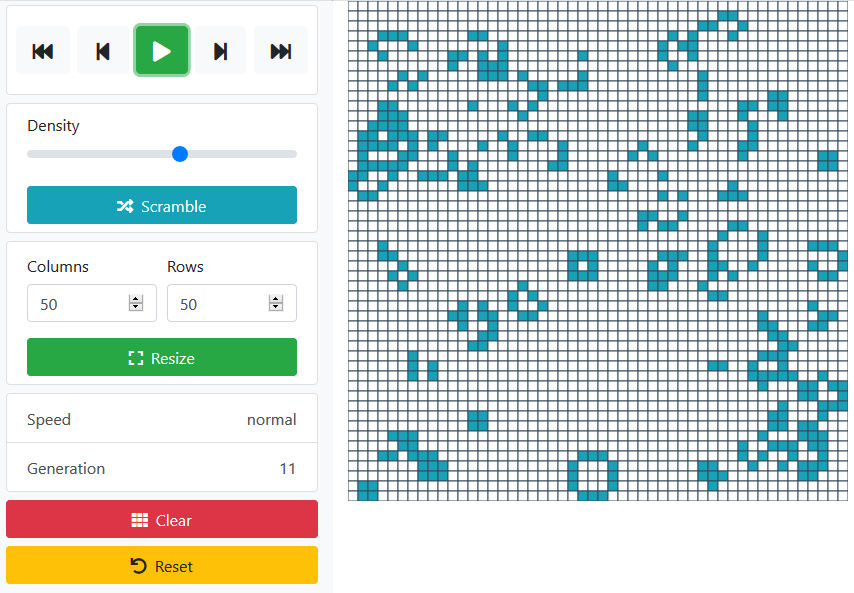

# Elm Game of Life

[Demo](http://wiry-steel.surge.sh/)

# Building

	elm make  --optimize --output=public/main.js src/Main.elm && npx uglify-js public/main.js --compress 'pure_funcs="F2,F3,F4,F5,F6,F7,F8,F9,A2,A3,A4,A5,A6,A7,A8,A9",pure_getters,keep_fargs=false,unsafe_comps,unsafe' | npx uglify-js --mangle --output public/main.min.js
	
	npx serve public
